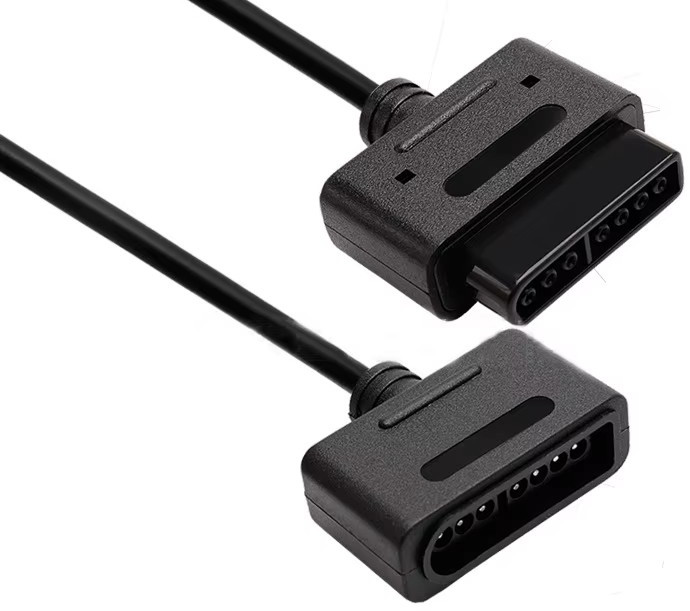

# SNES2USBDual
Adapter for two Super Nintendo (SNES) gamepads using an Arduino Leonardo Pro Micro from Dome's Blog - Building a USB SNES Controller (https://blog.chybby.com/posts/building-a-usb-snes-controller).
There are two code options to use:
* Joystick Library (https://github.com/MHeironimus/ArduinoJoystickLibrary)
* HID Library (https://github.com/NicoHood/HID)
Both works great, but usin HID the system show three gamepads, but just two functional.

## What you need:
* Arduino Pro Micro (Leonardo)
* 2 SNES female conectors - you can cut an extension cable.
* USB-C cable.
* Soldering skills.

## How to:
* Solder cables as schematic image.
* Install the library you decide to use.
* Upload correspondent sketch to your board.
* Play.

## Known Issues:
* Three devices in Windows instead of two. HID issue.

## Diagram:

## SNES Controller Pinout
`┌──────────────┬───────────┐`\
`│  1  2  3  4  │  5  6  7  )`\
`└──────────────┴───────────┘`

Pin 1: 5V\
Pin 2: Data_Clock (Arduino: Pin 2)\
Pin 3: Data_Latch (Arduino: Pin 3)\
Pin 4: Data_Serial (Arduino: Pin A0 / A1)\
Pin 5: N/A\
Pin 6: N/A\
Pin 7: GND

## Connectors options
### Extension Cable

### SNES Controller Port

